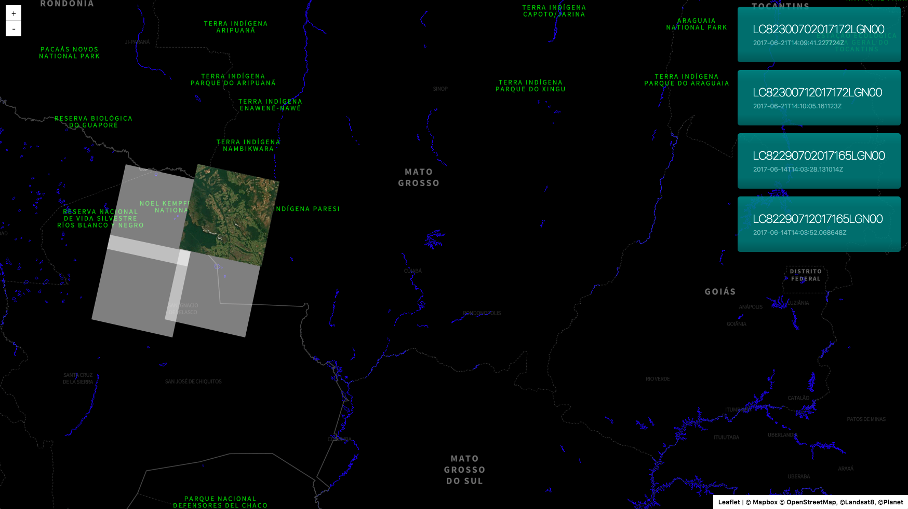

# landsat-viewer-ui


> Simple UI for querying and viewing recent [LANDSAT 8](https://landsat.usgs.gov) scenes.




## Running locally for development

```bash
./scripts/develop.sh
```


## Building

### Compiling all assets

```bash
./scripts/compile.sh
```

### Packaging for deployment

```bash
./scripts/package.sh
```


## Linting source code

```bash
./scripts/lint.sh

# Automatically fix certain linter errors
./scripts/lint.sh --fix
```
